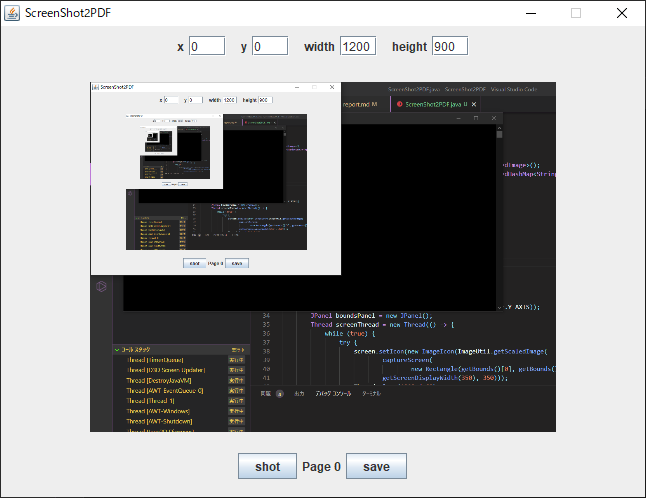
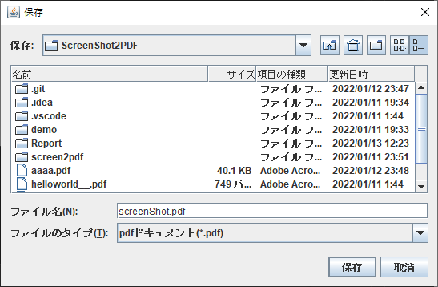
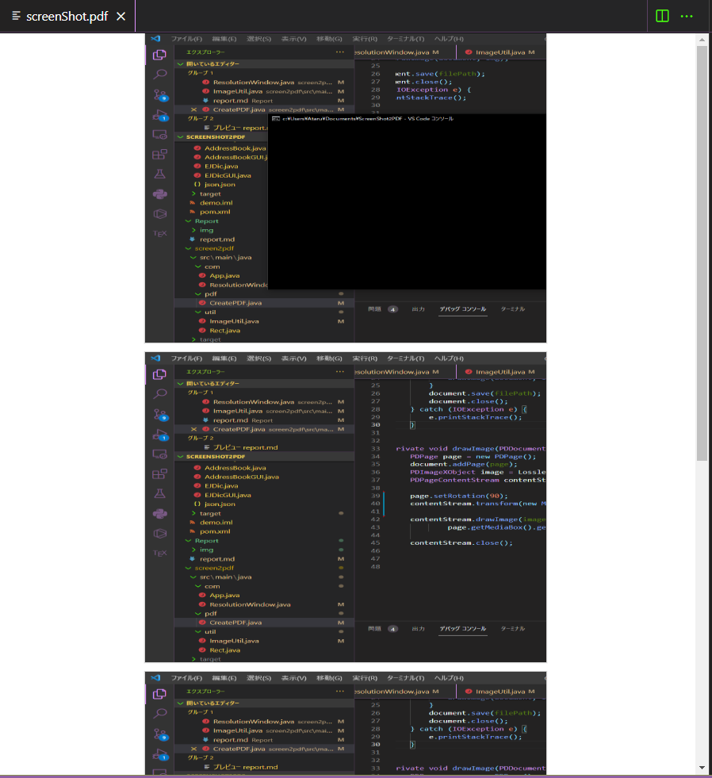

# ScreenShot2PDF

20FI100 松平陽

## 1. 機能

スクリーンショットを PDF ドキュメントとして保存することができるアプリケーション。

## 2. プログラムのポイントや工夫点

- 現在の画面を GUI 上に表示するために、Thread クラスを利用した。

- 内部クラスや匿名クラスを使用せず、addActionListener などはラムダ式を利用するようにした。

- Windows API を使用していないため、実行する OS に大きく依存しない設計になっている。(Windows,Ubuntu での動作を確認)

## 3. 使用パッケージ

- pdfbpx  
  Apache が提供する Java 向け PDF 編集ライブラリ
